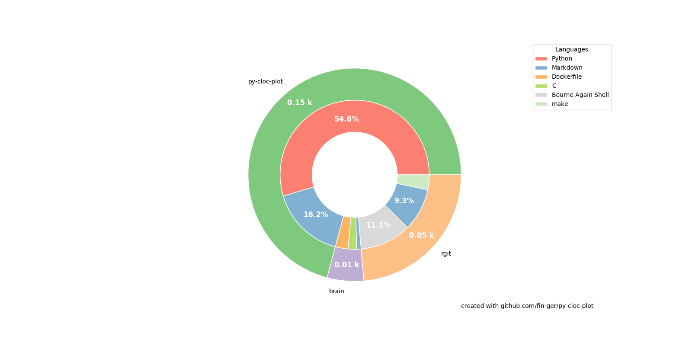

<h1 align="center">Welcome to cloc-plot 👋</h1>
<p>
  
  <a href="https://opensource.org/licenses/MIT">
    
  </a>
  <a href="https://twitter.com/fin_ger_github">
    
  </a>
</p>

> Render a donut chart for lines of code of multiple projects

### 🏠 [Homepage](https://github.com/fin-ger/py-cloc-plot)

## Install

Clone the repository and

```sh
pip install --user .
```

## Usage

```sh
cloc-plot path/to/project/root
```

This will place a file called `plot.png` in your current folder.

## Example



## Author

👤 **Fin Christensen**

* Twitter: [@fin_ger_github](https://twitter.com/fin_ger_github)
* Github: [@fin-ger](https://github.com/fin-ger)

## Show your support

Give a ⭐️ if this project helped you!

## 📝 License

Copyright © 2019 [Fin Christensen](https://github.com/fin-ger).<br />
This project is [MIT](https://opensource.org/licenses/MIT) licensed.

***
_This README was generated with ❤️ by [readme-md-generator](https://github.com/kefranabg/readme-md-generator)_
